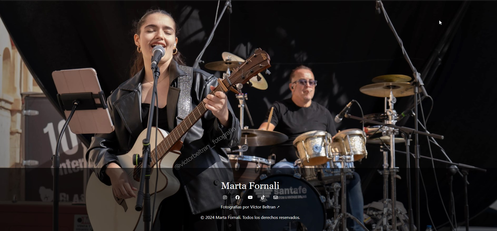
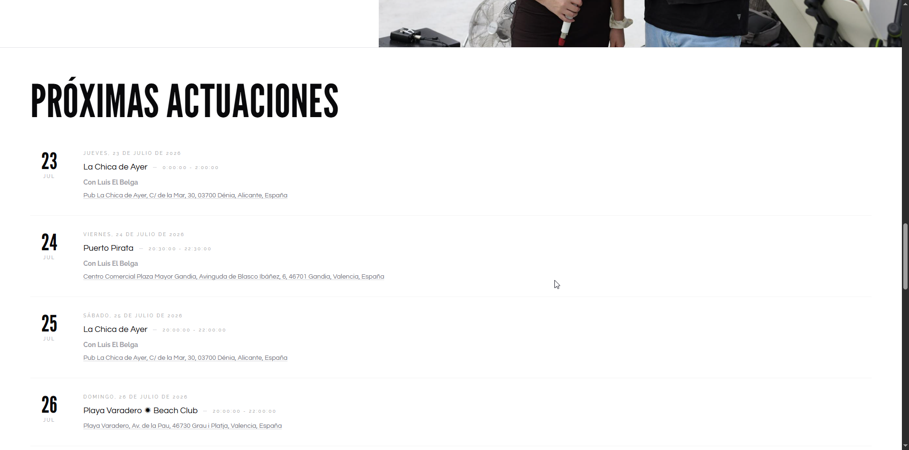

Hace un par de años, decidí hacerle un regalo de navidad a mi hermana Marta un poco más personal que una colonia o una tarjeta regalo de Zara. Decidí regalarle una web. Su primera web. https://martafornali.com/

Marta es, además de la mejor hermana del mundo, cantante desde hace 4 años. Poco a poco se ha ido haciendo un hueco en bares, restaurantes, chiringuitos y por susupuesto, bodas y demás eventos privados. Además, su paso por La Voz, el programa musical y un buen casting para Operación Triunfo 25 le han dado un pequeño nombre que hay que asegurar.

Por eso, creí que era el momento de darle su propio dominio profesional, su correo y una primera identidad en el voraz internet profesional. Entre Victor, su pareja y fotógrafo personal y yo, hicimos una primera versión de la web. Fotos de calidad, un par de enlaces y poco más.

Con el tiempo, hicimos un rediseño ya basado en lo que ella quiere mostrar al mundo. Colores blancos y negros, con textos grandes, secciones diferenciadas para mostrar que hace, como donde y con quien... Todo ello protagonizado por esas fotografías de Víctor.

Y esta última semana hice la que de momento es la actualización más importante y de mayor utilidad.

**Un calendario de eventos**

Porque las stories de Instagram caducan, los carteles bloquean el feed y bueno, porque es fácil ver en la web. 

Lo mejor a nivel tecnológico ha sido el reto. Buscaba algo sencillo de gestionar. 

Podría haber sido un json que fuera actualizandose en la web. Pero no es fácil de gestionar para alguien no técnico. Podría haber integrado un wordpress, o un servicio de eventos. Pero me parece matar moscas a cañonazos. 

Así que al final, esto es un calendario de google que todos los dias consulta un worker de cloudflare y lo guarda en KV. Además, automaticamente borra eventos antiguos. 

Para gestionarlo solo tenemos que añadir eventos al calendario de google y directamente salen en la web. 

Así que tenemos un resumen en la home y una página con el resto de actuaciones en https://martafornali.com/eventos

Así de simple, y así de efectivo.