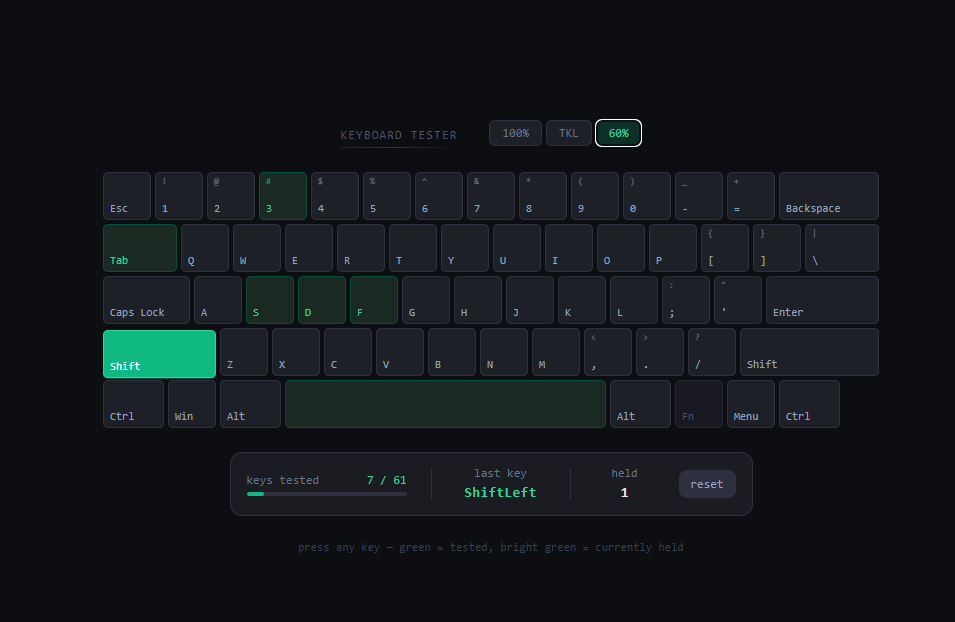

Hace unos días, mi teclado decidió hacer cosas raras. La tecla de ALT y WIN se intercambiaron, la de mayúsculas parecía permanentemente pulsada... Ese tipo de cosas.

Tengo un Royal Kludge 61. Un teclado mecánico barato. Muy barato. Ya sabeis, RGB, pequeño (60%), con una bateria decente y conectable por Bluetooth o por su USB inalámbrico.

Debo decir que no lo cambio por nada. Me parece muy cómodo de usar y es realmente bonito si no le pones el modo arcoiris.

Pero como buen teclado barato, tiene un software bastante malo. Todo son combinaciones de teclas con el FN, tiene tropecientos modos para que las teclas funcionen de otra forma... Y lo peor, es que se controla solo con las combinaciones. El software no sabe si estás en modo Windows o Mac, o si tienes las flechas bloqueadas.

Claro, esto es un problema si pulsas sin querer. Resulta que la combinación `FN + S` cambia a Modo Mac (o OSX). Esto hace que la tecla Windows y Alt se intercambien y algun cambio mas con las teclas de funcion (F1 a F12).

Dos días así sin saber porque. Pensaba que en algun momento de limpiar el teclado había cambiado las teclas de sitio y todo. Así que cogí a Claude, le expliqué el problema y me hizo un pequeño plan explicativo para crearme un sitio web para probar el teclado.

Unas horas después tenía https://keyboard-test.pabsy.dev.

Soporte para tres layouts de teclados, un diseño limpio, cuantas teclas tienes a la vez pulsadas...

Diria que es un 70% código de claude y 30% mio. Me gusta tener a la IA ahí escribiendo y después hacer mis correcciones o avances.

Vite, react y tailwindcss. Un stack simple para una app simple.

Hacía tiempo que no tocaba los eventos de teclado, incluso hacía tiempo que no tocaba Vite, me he pasado a Astro, [ya sabeis](https://pabsy.dev/blog/astro-sencillez-hecha-framework/), pero es bonito revisitar esto que normalmente no uso.

Y bueno, pues eso, que he comprobado que a nivel personal, la IA como Claude me está ayudando a gestionar problemas simples con herramientas aún más simples.

Por cierto, el problema era ese, que había pulsado `FN + S` y habias puesto el modo MAC. Con `FN + A` se arregló el tema.
